-----------------------------------
Carrito de Compras SuperStore
-----------------------------------
Este programa proporciona una interfaz gráfica para gestionar un carrito de compras en una tienda utilizando códigos de barras y la lectura de imágenes.

Alcances y limitaciones:
- Se trabajará con un máximo de 10 productos y códigos de barras para facilitar la demostración del uso del programa.
- El programa permite la gestión de una lista predefinida de productos con sus debidos códigos, nombres y precios. En caso de querer agregar más códigos se debe realizar desde el código de python.
- Debido a que el proyecto tiene fines académicos solo se puede agregar un producto a la vez y solo puede ser utilizado por un usuario a la vez.
- Tiene dos tipos de operación: seleccionar la imágen del código de barras para su decodificación e ingreso de datos y/o la inserción del dato manual (escribiendo el código de barras). 
- Se limita a la decodificación del código por medio de una sola imágen subida en formato PNG, para que funcione debe ser agregada en la lista prestablecida.
Nota: Se omite mostrar los productos en caso de que su cantidad es 0.
  
Repositorio:

El código fuente está disponible en: https://github.com/meza24/proyecto-de-python.git

Para clonar el repositorio:
$ git clone https://github.com/meza24/proyecto-de-python.git

Requisitos:
- Python 3.x
- Bibliotecas necesarias:
  - tkinter
  - OpenCV (cv2)
  - pyzbar

Instalación de las bibliotecas:
$ pip install opencv-python-headless pyzbar

Uso:
1. Ejecuta el programa utilizando Python con el archivo inventario12.py.
2. Acciones disponibles:
   - Agregar productos desde imágenes con códigos de barras.
   - Agregar productos manualmente ingresando códigos de barras y cantidades.
   - Restar productos desde imágenes con códigos de barras.
   - Restar productos manualmente ingresando códigos de barras y cantidades.
   - Mostrar el contenido del carrito de compras.
   - Calcular el total a pagar.
   - Visualizar la fecha y hora actual.

Pasos para la ejecución del código desde la terminal
1. Abrir la terminal: Command Prompt en Windows (símbolo de sistema o PowerShell), Terminal en macOS o Linux.
2. Navegar hasta el directorio donde se encuentra tu archivo Python: usando el comando cd (change directory). Por ejemplo, si tu archivo está en el escritorio y estás en el directorio de inicio, podrías escribir cd Escritorio en Windows.
3. Ejecutar el archivo de Python: utiliza el comando python seguido del nombre de tu archivo. Por ejemplo, para un archivo llamado mi_script.py, escribe python mi_script.py y presiona Enter. Si estás utilizando Python 3, es posible que necesites escribir python3 en lugar de python. También puedes escribir directamente la versión de Python más el directorio, por ejemplo, python3 /home/usuario1/Descargas/inventario12.py.

Tutorial:

- Paso 1: Digitar cantidad.

- Paso 2: Elegir la función que desea realizar.
- Agregar desde Imagen:
  - Seleccionar una imagen con un código de barras válido en formato PNG y que esté dentro de la lista de productos.
  - Oprimir Abrir.
  - Decodificará el código y saldrá un mensaje de que se agregaró el producto al carrito.

  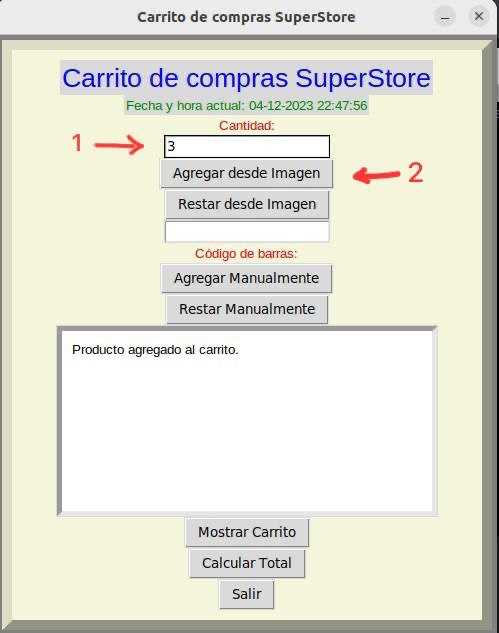
  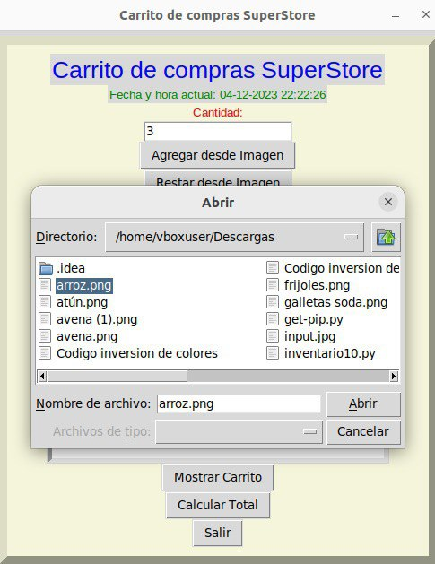
  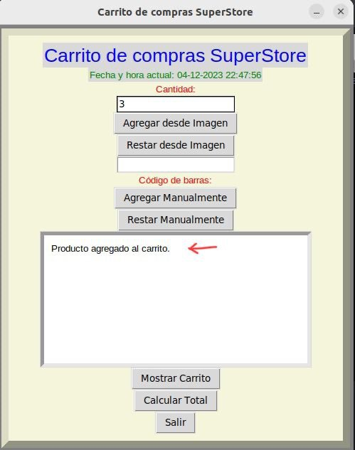

- Restar desde Imagen:
  - Seleccionar una imagen con un código de barras válido en formato PNG y que esté dentro de la lista de productos.
  - Oprimir Abrir.
  - Decodificará el código y saldrá un mensaje de que se restó el producto al carrito o un mensaje de que no existe producto en el carrito en caso de que la cantidad ingresada sea mayor a la del carrito.
 
  

  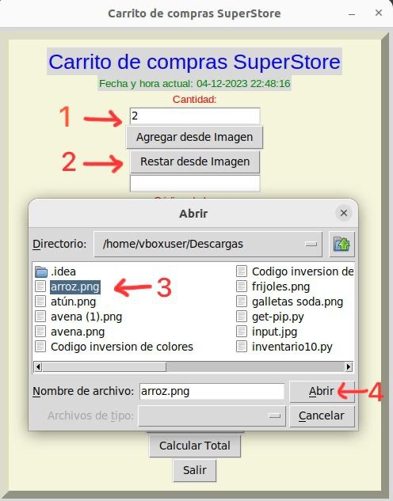
  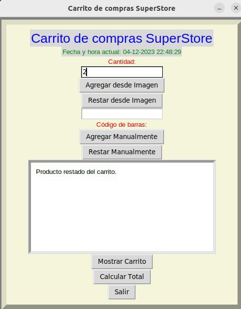

    
- Agregar manualmente:
  - Ingresar el código de barras (números).
  - Oprimir Agregar manualmente.
  - Se añadirá al carrito si el código es válido.
 
   

  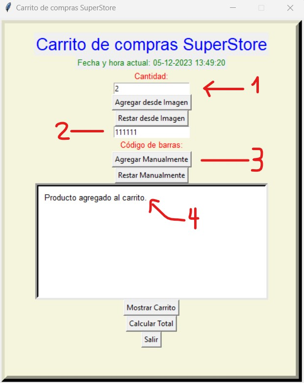
  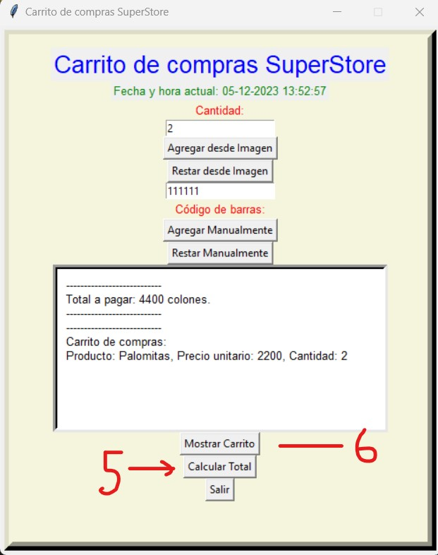
   
   

  - Si el código no es válido, ocurre un error

    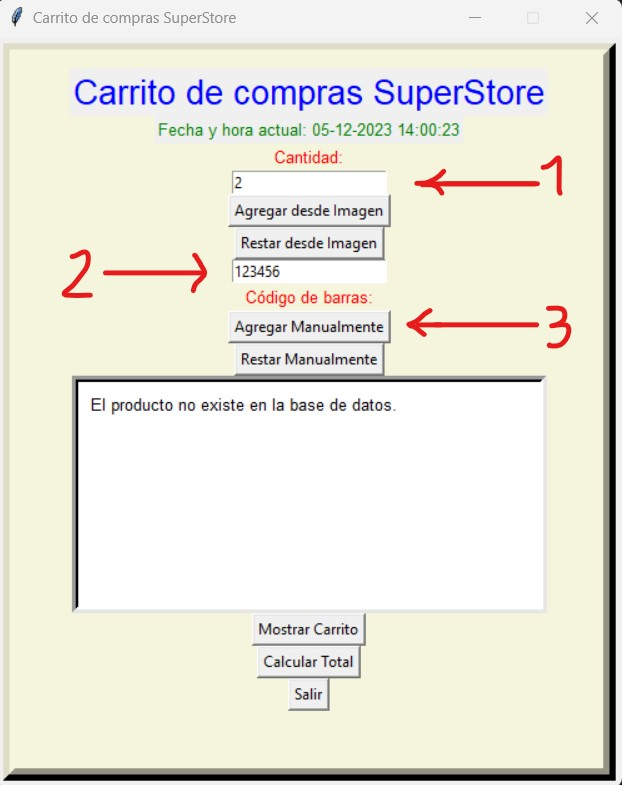

- Restar manualmente:
  - Ingresar el código de barras (números).
  - Oprimir Restar manualmente.
  - Se restará al carrito si el código es válido.
  - Si el código no es válido, ocurre un error
   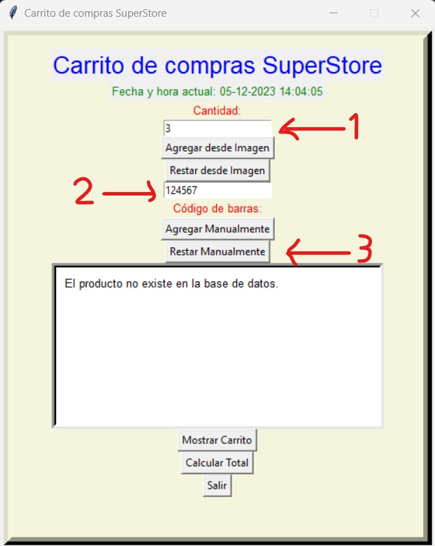
    

- Mostrar Carrito:
  - Visualizará una lista detallada de productos en el carrito, con cantidades y precios.
    
 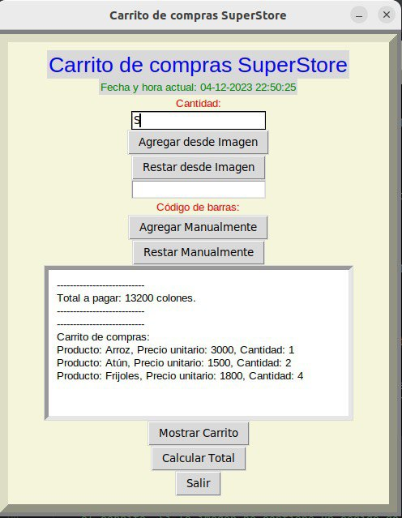
    

- Calcular Total:
  - Devuelve el monto total a pagar por todos los productos en el carrito.
 
  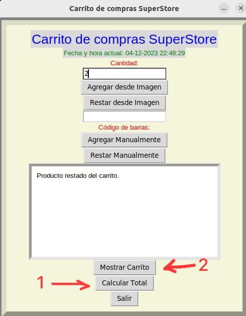

Funcionalidades Principales:

Factura:
- Administra la base de datos de productos y el carrito de compras.
- Métodos para agregar, visualizar y calcular el total de productos.
- Capacidad para agregar productos desde imágenes con códigos de barras.

InterfazFactura:
- Crea una interfaz gráfica con tkinter.
- Interactúa con la clase Factura de manera amigable.
- Permite agregar productos, visualizar el carrito y obtener el total a pagar.

Autor:
Desarrollado por Axel Meza Mejias, Evelyn Feng Wu, Diego José Acosta Obando y Gabriel Porras Salas
